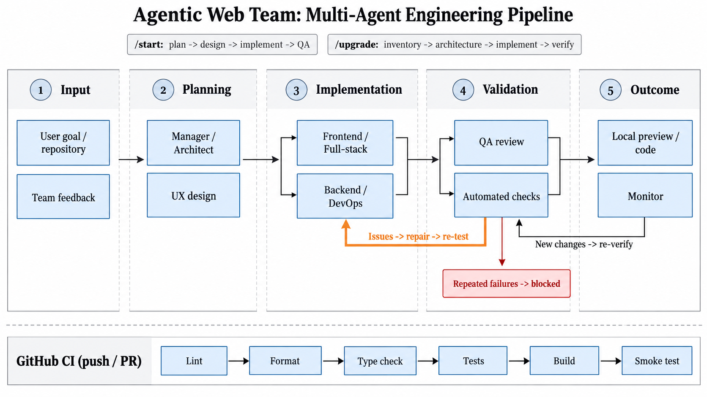

# Agentic Web Team

Agentic Web Team is a local CLI that coordinates a role-based AI development team around a real workspace. It can help plan and build new web projects, upgrade existing repositories, run verification checks, route QA findings back to the right owner, and keep monitoring the project until you stop the workflow.

The web workflow uses a lead, UX designer, frontend engineer, backend engineer, and QA engineer. The repository-upgrade workflow uses a lead architect, senior full-stack engineer, DevOps engineer, and automation QA engineer. All roles share one configured OpenAI-compatible model endpoint; the default setup uses a local Ollama model.

This project is designed for hands-on development work, not throwaway demos. The CLI waits for a real goal, works against the workspace you select, records state between turns, and keeps evidence from tests, checks, and review in the loop. The agents can speed up development, but they are still tools: inspect generated changes before shipping.

## Highlights

- Role-based workflows for new web builds and existing repository upgrades
- Persistent project state, shared notes, and resumable background service mode
- QA repair loops that route findings back to UX, frontend, backend, full-stack, or DevOps
- Local-first model support through Ollama, with OpenAI-compatible endpoint configuration
- Built-in preview helpers for common Node and Django projects
- Deterministic verification using lint, type, test, build, syntax, and HTTP smoke checks where available

## Pipeline overview



The diagram shows how work moves from the initial request into planning, role handoff, implementation, verification, repair loops, and monitoring. `/start` focuses on building a web project from a goal, while `/upgrade` focuses on improving an existing repository. GitHub CI stays separate and runs on pushes and pull requests.

## Requirements and installation

- Python 3.11 or newer
- Ollama with `qwen3.5:9b`, or another OpenAI-compatible model endpoint
- Node.js/npm for generated Node projects; Python/pip for generated Django projects
- macOS or Linux for the Unix-socket background service
- An existing repository and its toolchain for `/upgrade`; use `--allow-shell` to permit automated builds, tests, installs, and arbitrary shell commands

```bash
python3 -m venv .venv
.venv/bin/python -m pip install -e .
ollama pull qwen3.5:9b
.venv/bin/agentic-web-team --workspace ./project
```

For contributor tools, install `.[dev]`. The program attempts to start Ollama when its configured local endpoint is unavailable. Use `--config path/to/team.yaml` to select a custom team. The editable checkout uses `config/team.yaml`; built wheels include the same default configuration and role skills.

## Upgrading an existing repository

Point `--workspace` at the repository to modify. From the `agentic_web_team` checkout, `--workspace .` selects this codebase. For another project, replace `.` with that project's real existing path. The literal example `/absolute/path/to/repository` is not a directory and must not be used.

```bash
.venv/bin/agentic-web-team --workspace . --allow-shell --serve
# In another terminal:
.venv/bin/agentic-web-team --workspace .
```

```text
You -> Team> /upgrade Refactor this repository, preserve existing behavior, strengthen tests and CI, and fix verified errors
You -> Team> /work
You -> Team> @architect What are the highest-risk findings?
You -> Aria> @fullstack @devops What changed and what checks ran?
You -> Satria + Dewa> /feedback Keep the existing database schema unchanged
You -> Satria + Dewa> /stop
```

`/upgrade` runs `inventory -> architecture -> implementation -> verification -> repair -> verification -> monitor`. The inventory lists accessible source files and manifests, skipping generated directories and private files; it is bounded at 20,000 files, and the agent can inspect individual files with read/search tools. The architect establishes the plan, the full-stack engineer changes source and tests, DevOps handles configuration and build infrastructure, and QA checks actual files and deterministic command output. QA findings route back to their owner. Monitoring rechecks at the configured interval until `/stop`; persistent identical failures enter `blocked` and resume on feedback or changed evidence. `blocked` is not success.

`--allow-shell` must be set on the **service process** to enable agent shell commands and project checks in a persistent upgrade loop. Without it, the workflow can inspect files and parse Python syntax/manifests but build/test commands report execution disabled. Shell calls have 300-second maximum timeouts, bounded output, and start/finish records in `<workspace>/.agentic_web_team/terminal_audit.jsonl`. This is a powerful permission: commands run as your OS account, inherit its environment, and can access files outside the workspace. File-tool role boundaries do not constrain shell commands. Use a disposable account/container and a backed-up repository when operating on untrusted code; never grant this flag to a model or project you do not trust.

## Working with the team

```text
You -> Team> /start Build [your actual goal, pages, framework, database, and constraints]
You -> Team> /work
You -> Team> @ux What is the current user flow?
You -> Nadia> @frontend @backend What are you each working on?
You -> Faye + Bima> /feedback Change the signup flow to [your requirement]
You -> Faye + Bima> /stop
```

`/start` runs the persisted sequence `plan -> design -> implement -> QA -> repair -> QA -> monitor`. Backend and frontend implementation run concurrently after the UX handoff. QA issues are assigned to UX, frontend, or backend and rechecked. Identical repeated failures become `blocked` instead of looping indefinitely. External file changes or `/feedback` can wake a blocked review. A normal message to `@team` is a one-shot team conversation, not a continuous project start.

Use `@ux`, `@frontend`, `@backend`, `@qa`, `@manager`, `@architect`, `@fullstack`, or `@devops` for private role chats. Multiple leading mentions get separate replies; unaddressed follow-ups stay with the selected teammate(s). `@team` addresses the web team during `/start` and the upgrade team during `/upgrade`. You can continue chatting while a workflow runs. Substantive direct instructions during an active workflow are also recorded as workflow feedback.

| Command | Purpose |
| --- | --- |
| `/team` | List teammates |
| `/start <goal>` | Start a project workflow |
| `/upgrade <goal>` | Start an autonomous repository-upgrade workflow |
| `/work` or `/status` | Show phase, issues, and active chat requests |
| `/feedback <note>` | Send a correction to the workflow |
| `/cancel` | Cancel pending chat replies, not the workflow |
| `/files`, `/show <file>` | Inspect workspace files |
| `/run`, `/stop-preview` | Start or stop local project previews |
| `/remember <decision>` | Save a shared project decision |
| `/stop` | Stop the workflow and local previews |
| `/exit` | Leave chat |

## Background service

Run the service in one terminal and chat in another, using the same workspace:

```bash
.venv/bin/agentic-web-team --workspace ./project --serve
.venv/bin/agentic-web-team --workspace ./project
```

The second command belongs in a separate terminal. It sends `/start`, `/upgrade`, `/work`, `/feedback`, and `/stop` to the service over an owner-only Unix socket. Closing chat does not stop the service. Without `--serve`, work runs in the chat process, pauses on `/exit`, and resumes next time. Only one process may own a workspace workflow. `--serve` is not installed as an operating-system login service; start it explicitly or configure your own process manager. `/stop` ends the current loop but leaves the service idle for a future goal.

`/work` reports the active phase and, on services started with the current version, which agent call is in progress. A started workflow is not a completed build; source files appear only when implementation begins writing them. The service log and saved work state are under `<workspace>/.agentic_web_team/`.

## Architecture

```text
agentic_web_team/
  agentic_web_team/
    agent.py             Role prompts and model/tool turns
    cli.py               Entry point and local model readiness
    config.py, models.py Validated YAML and environment configuration
    defaults/            Packaged team config and role skills
    llm.py               OpenAI-compatible model adapter
    inventory.py         Bounded repository and manifest inventory
    logging_setup.py     Rotating JSON service log
    orchestrator.py      Team routing, shared context, role coordination
    preview.py           Typed local Node/Django preview lifecycle
    process.py           Bounded, timeout-aware subprocess execution
    quality.py           Deterministic checks and HTTP smoke tests
    upgrade.py           Architect/developer/DevOps/QA upgrade cycle
    upgrade_quality.py   Project-aware syntax, lint, type, test, build checks
    service.py           Local Unix-socket command transport
    storage.py           Atomic state, shared history, process lease
    terminal.py          Interactive commands and Rich output
    tools.py             Agent tool schemas and permission dispatch
    workflow.py          Persisted multi-role work cycle
    workflow_state.py    Validated QA and workflow data
    workspace.py         Workspace filesystem boundary
  config/, skills/        Editable checkout defaults
  tests/                  Unit and local integration tests
  .github/workflows/ci.yml
```

The workspace is the selected project, not necessarily this repository's source tree. In web mode, UX writes under `design/`, frontend under `frontend/`, and backend under `backend/`. In upgrade mode, full-stack file tools can write across the selected workspace (excluding private/generated paths); DevOps has configuration/infrastructure paths. Lead, architect, and QA have no file-write tool. Tool calls are permission-checked. State, notes, conversation history, shell audit, preview logs, and JSON service logs live under `<workspace>/.agentic_web_team/`. Existing work-state JSON files are read without migration; invalid or unsupported state is reported rather than silently discarded.

For Node projects, the preview uses `npm ci` when a lockfile exists, otherwise `npm install`, then a `dev` or `start` script. For Django projects, it creates a workspace-local virtual environment from `backend/requirements.txt`, runs Django checks, applies migrations only to SQLite inside the workspace, and starts `runserver` on loopback. External database migrations are not automatic. QA runs available builds/tests and an HTTP connectivity check; it does not claim browser-level verification.

## Configuration

Edit `config/team.yaml` or pass `--config`. Role permissions, allowlisted check commands, retry limits, and monitor interval are validated at startup. Shell environment variables override model connection settings:

| Variable | Meaning |
| --- | --- |
| `AGENTIC_WEB_TEAM_MODEL` | Model name |
| `AGENTIC_WEB_TEAM_BASE_URL` | OpenAI-compatible endpoint; non-local HTTP is rejected |
| `AGENTIC_WEB_TEAM_API_KEY` | Endpoint credential |
| `AGENTIC_WEB_TEAM_TEMPERATURE` | Sampling temperature |
| `AGENTIC_WEB_TEAM_MONITOR_SECONDS` | QA monitor interval, minimum 10 seconds |

See `.env.example`. The CLI reads **exported environment variables**; it does not load `.env` automatically. `--verbose` enables debug-level entries in `<workspace>/.agentic_web_team/service.log`.

## Development and verification

```bash
.venv/bin/python -m pip install -e '.[dev]'
.venv/bin/ruff check .
.venv/bin/ruff format --check .
.venv/bin/mypy agentic_web_team
.venv/bin/python -m unittest discover -s tests -v
```

CI runs lint, formatting, types, tests, a wheel build, and an installed-package smoke test on Python 3.11 and 3.13. The local service integration test needs Unix-socket access and skips in restrictive sandboxes.

## Trust boundary and limitations

The agent can write files in its role-owned project folders. Starting a generated app or running its build/tests executes code and dependency installation from that workspace. Use a workspace and dependencies you trust; this is not an isolation sandbox or a production deployment platform. Private `.env` files, key files, and internal state are not exposed through the agent file tools, but project scripts can still access the host account that runs them. For stronger isolation, run the entire program under a separate OS user or container with explicitly mounted project files and model access.

QA evidence and senior role prompts improve the development loop but do not guarantee zero errors, security, correctness, performance, or human-level engineering. The upgrade runner detects common Python, Node, Go, and Rust checks; it does not infer every custom build system, vulnerability, or runtime path. Review generated code, dependency changes, database settings, and test output before deploying a project beyond localhost. Project notes improve continuity; they do not retrain model weights.
